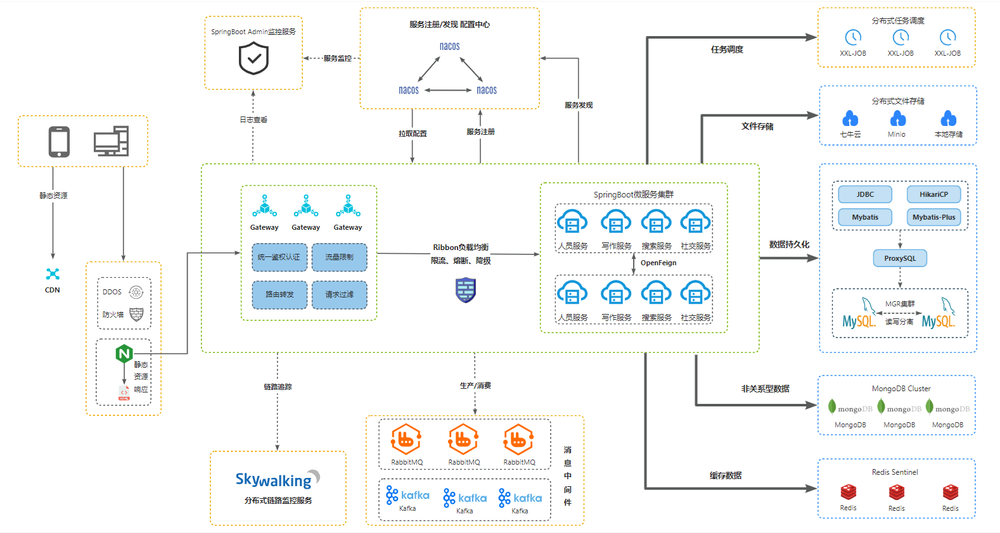

<h1 align="center" style="margin: 30px 0 30px; font-weight: bold;">IT充电站</h1>
<h4 align="center">基于 Vue/iView UI 和 Spring Boot/Spring Cloud & Alibaba 前后端分离的分布式微服务架构</h4>

## 平台简介

it充电站，可以是你的私人博客，用来记录你的成长轨迹，也可以是一个知识社区，共同见证你我的成长，还可以是你生活的一角，记你所想，随笔一生，记录生活的点点滴滴！
在这里，没有CSDN那样烦人的广告，也没有掘金那样的包揽万象，但却有着语雀一样简约大方，有着博客园一样的高质量，同时还可以沉浸式满足你的专注写作，也可以自定义主题满足你的天马行空！

* 采用前后端分离的模式，微服务版本前端(https://gitee.com/ichargehub/it-charge-station)。
* 后端采用Spring Boot、Spring Cloud & Alibaba。
* 注册中心、配置中心选型Nacos，权限认证使用Gateway + Redis。
* 流量控制框架选型Sentinel，分布式事务选型Seata。

## 系统模块

~~~
com.lovbe     
├── icharge-gateway             // 网关模块 [10210]
├── icharge-auth                // 认证中心 [10212]
├── icharge-common              // 通用模块
    └── pom.xml                 // 公共依赖管理
├── icharge-user                // 用户模块 [10211]
├── icharge-content-product     // 内容生产模块 [10214]
├── icharge-storage             // 文件存储模块 [10213]
├── icharge-social              // 社交模块 [10215]
├── pom.xml                     // 依赖管理
~~~

## 架构图

